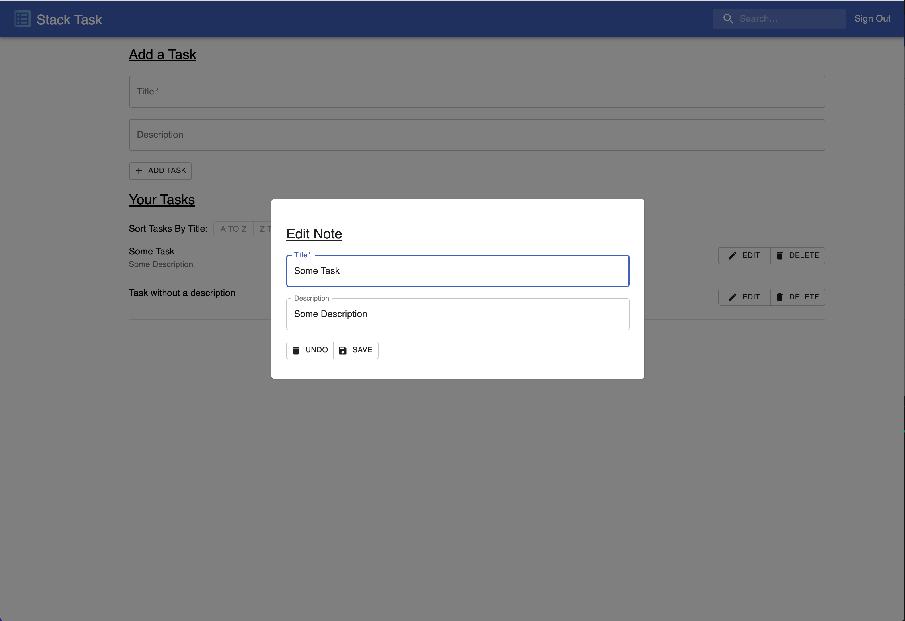

# Todo App - CRUD Application

This is a data persistent CRUD application that was developed with React, Express, Node, PostgreSQL and Material-UI. The Client, Server, and Database are deployed on Heroku.

---

## Table of Contents

### **[Instructions for Viewing](#instructions-for-viewing)** 

### **[Client Documentation](#client-documentation)** 

## Instructions for Viewing

[The deployed application can be viewed here](https://andrew-bradt-todo-frontend.herokuapp.com/). You may sign up with your own email address and password to use the application, or sign in with the existing credentials:

- Email: testuser@gmail.com
- Password: 9999

#### **_NOTE: This application was deployed with a free-tier of Heroku, so there is a possibility the servers may be in an idle state and result in longer load times when you first navigate to the application._**

---

## Client Documentation

---

### Components

---

#### App

---

#### Login & Sign-Up

## 

## 

- These components allow users to sign up for an account or log in to their existing account.
- A post request with the credentials will only be made if all fields are populated.
- The Sign-Up component will only make a post request if text entered into both the **_Password_** and **_Confirm-Password_** fields are identical.

---

#### Layout

- This component is rendered in the **_App_** component and contains the navigation bar and also wraps the **_Todos_** and **_Add Task_** components.

---

#### Add Task

## 

- Two input fields, labeled **_Title_** and **_Description_**, allow for the user to enter new tasks. The task will be added after clicking the **_ADD Task_** button
- Tasks will not be added unless the **_Title field_** is populated.

#### Edit Modal

## 

---

#### Todo and Todos

## 

- Tasks are listed chronologically by default, but can arranged in alphabetical or reverse-alphabetical order.
- Tasks can also be filtered by title using the search field in the navigation bar.
- Clicking the **_EDIT_** button will open the **_Edit Modal_** component populated with the corresponding task data.
- Clicking the **_DELETE_** button will permanently delete the task.

---

## Server Documentation

---

### End Points

---

#### /add-todo

- Responds to a POST request
- Accepts **_user_id_** as a query parameter.
- Accepts **_title_** and **_description_** from the request body.
- Inserts a new row into the **_todos_** table, with the **_title, description,_** and **_user_id_** data.
- Returns the **_todo_id_**, **_title_**, and **_description_** data.

---

#### /change-todo

- Responds to a PUT request
- Accepts **_todo_id_** as a query parameter.
- Utilizes **_title_** and **_description_** from the request body.
- Overwrites the existing **_title_** and **_description_** in the row containing the provided **_todo_id_**.
- Returns the **_todo_id_**, **_title_**, and **_description_** data.

---

#### /create-user

- Responds to a POST request
- Utilizes **_email_** and **_password_** from the request body.
- If there are no rows in the **_users_** containing the provided **_email_** in the database, a new one will be added with a **_user_id_**, **_email_**, and **_hash_** generated from the password provided in the request.

---

#### /get-todos

-- Responds to a GET request.
-- Accepts **_user_id_** as a query parameter.
-- Returns the **_todo_id_**, **_title_**, and **_description_** from every row in the **_todos_** table with a matching **_user_id_**.

---

#### /login

- Responds to a POST request
- Utilizes **_email_** and **_password_** from the request body.
- Retrieves a row from the **_users_** table if the provided **_email_** matches any of the records
- Compares the provided password with the retrieved **_hash_**. If they match, the server responds with the **_email_** and **_user_id_** from the database.

---

#### /remove-todo

---

## Database Documentation

---

### Tables

---

#### Users

---

#### Todos

---

## Additional Features

---
