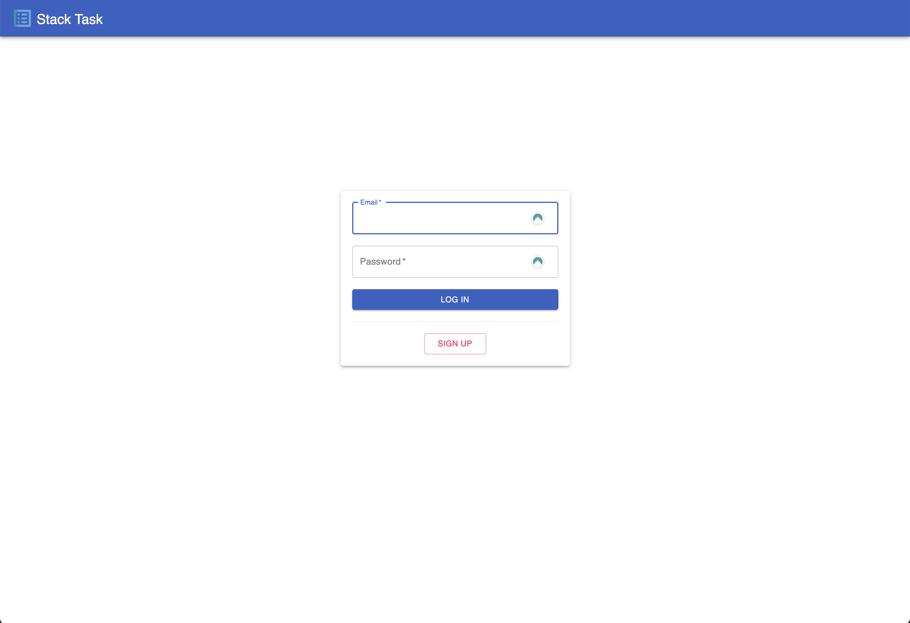

# Todo App - CRUD Application

This is a data persistent CRUD application that was developed with React, Express, Node, PostgreSQL and Material-UI. The Client, Server, and Database are deployed on Heroku.

---

## Instructions for Viewing

The deployed application can be viewed [here](https://andrew-bradt-todo-frontend.herokuapp.com/).

#### **_NOTE: This application was deployed with a free-tier of Heroku, so there is a possibility the servers may be in an idle state and result in longer load times when you first navigate to the application._**

---

## Client Documentation

---

### Components

---

#### App

---

#### Login & Sign-Up

## 

## 

---

#### Layout

---

#### Add Task

## 

---

#### Edit Modal

## 

---

#### Todos

## 

---

#### Todo

## 

---

## Server Documentation

---

### End Points

---

#### /add-todo

---

#### /change-todo

---

#### /create-user

---

#### /get-todos

---

#### /login

---

#### /remove-todo

---

## Database Documentation

---

### Tables

---

#### Users

---

#### Todos

---

## Additional Features

---
